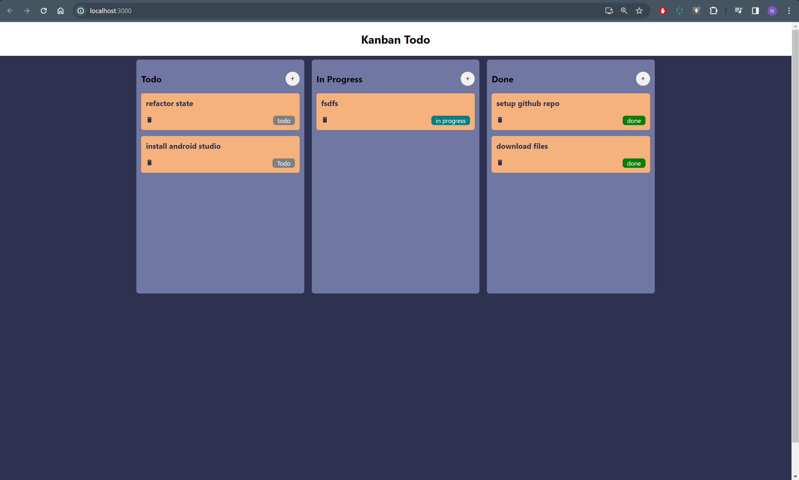

# React Kanban Todo App

A simple Kanban-style Todo application built with React, Zustand for state management, and drag-and-drop functionality for task management.

## Screenshot



## Features

- **Kanban Board:** Organize your tasks into three boards: To Do, In Progress, and Done.
- **Drag and Drop:** Easily move tasks between different boards using drag-and-drop functionality.
- **Zustand State Management:** Utilizes Zustand for efficient state management in React.

## Getting Started

### Prerequisites

- Node.js: Make sure Node.js is installed on your machine.

### Installation

1. Clone the repository:

   ```bash
   git clone https://github.com/nabekabebe/Kanban-Zustand-React.git
   ```
